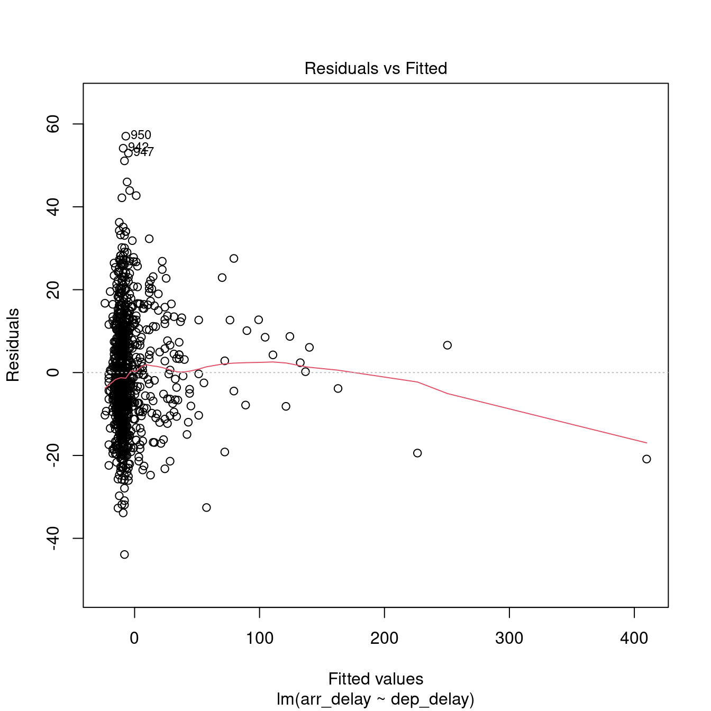
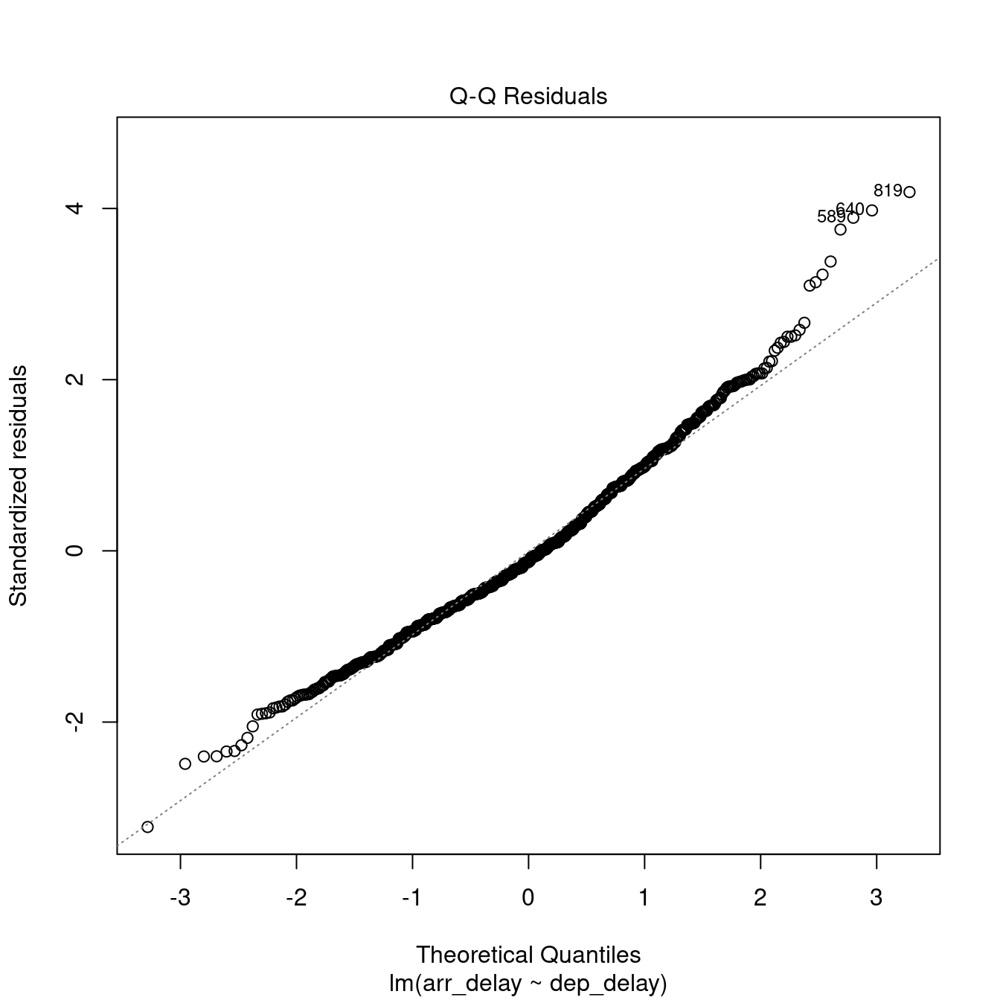
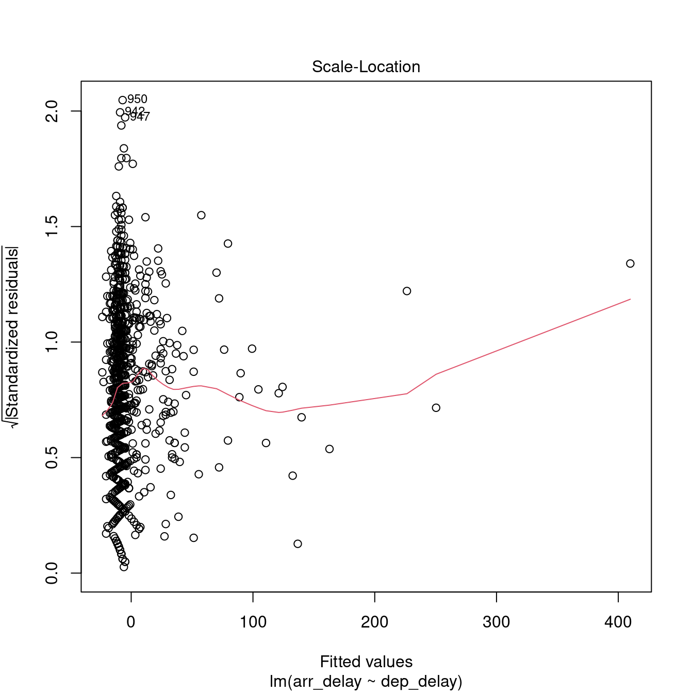
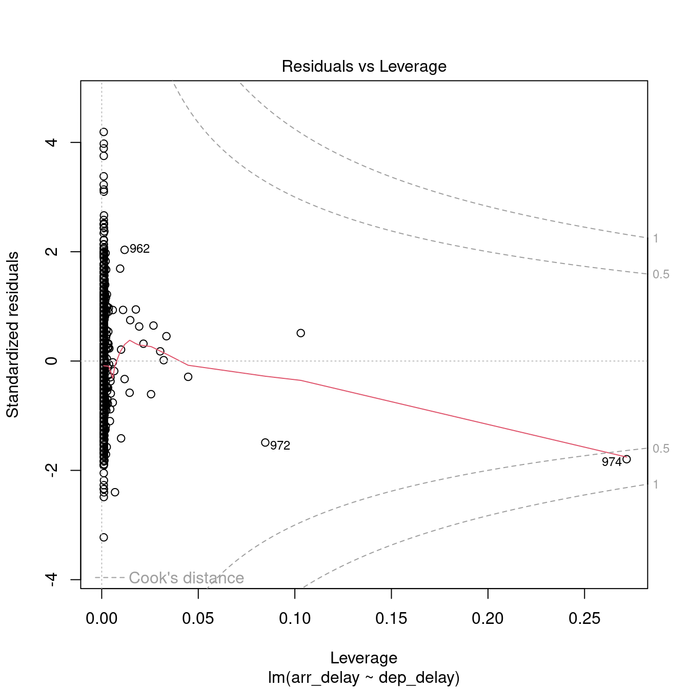

# Regression analysis

<br/><small><a href="javascript:if(window.print)window.print()">Print this chapter</a></small>

This chapter focuses on regression analysis, starting from simple regression and then multiple regression analysis. Both sections discuss how to run a regression analysis and (importantly) how to check that the analysis meets the test assumptions and how to report the results in an analysis document.


```r
library(tidyverse)
library(magrittr)
library(knitr)
```


## Simple regression

The simple regression analysis is a supervised machine learning approach to creating a model able to predict the value of one outcome variable $Y$ based on one predictor variable $X_1$, by estimating the intercept $b_0$ and coefficient (slope) $b_1$, and accounting for a reasonable amount of error $\epsilon$. 

$$Y_i = (b_0 + b_1 * X_{i1}) + \epsilon_i $$

Least squares is the most commonly used approach to generate a regression model. This model fits a line to minimise the squared values of the **residuals** (errors), which are calculated as the squared difference between observed values the values predicted by the model. 

$$redidual = \sum(observed - model)^2$$

A model is considered **robust** if the residuals do not show particular trends, which would indicate that *"something"* is interfering with the model. In particular, the assumption of the regression model are:

- **linearity:** the relationship is actually linear;
- **normality** of residuals: standard residuals are normally distributed with mean `0`;
- **homoscedasticity** of residuals: at each level of the predictor variable(s) the variance of the standard residuals should be the same (*homo-scedasticity*) rather than different (*hetero-scedasticity*);
- **independence** of residuals: adjacent standard residuals are not correlated.

### Simple regression example

The example that we have seen in the lecture illustrated how simple regression can be used to create a model to predict the arrival delay based on the departure delay of a flight, based on the data available in the `nycflights13` dataset for the flight on November 20th, 2013. 

$$arr\_delay_i = (Intercept + Coefficient_{dep\_delay} * dep\_delay_{i1}) + \epsilon_i $$

The last line below arranges the table by arrival delay. It is advisable to give a meaningful order to the data (e.g., based on the outcome) before creating the model, in order to facilitate a robust execution of the Durbin-Watson test (see below).


```r
# Load the library
library(nycflights13)

# November 20th, 2013
flights_nov_20 <- flights %>%
  filter(
    !is.na(dep_delay) &
    !is.na(arr_delay) &
    month == 11 &
    day ==20
  ) %>% 
  arrange(dep_time)
```

The scatterplot below seems to indicate that the relationship is indeed linear.


The code below generates the model using the function `lm`, and the function `summary` to obtain the summary of the results of the test. The model and summary are saved in the variables `delay_model` and `delay_model_summary`, respectively, for further use below. The variable `delay_model_summary` can then be called directly to visualise the result of the test.


```r
# Classic R coding version
# delay_model <- lm(arr_delay ~ dep_delay, data = flights_nov_20)
# delay_model_summary <- summary(delay_model)

# Load magrittr library to use %$%
library(magrittr)

delay_model <- flights_nov_20 %$%
  lm(arr_delay ~ dep_delay) 

delay_model_summary <- delay_model %>%
  summary()

delay_model_summary
```

```
## 
## Call:
## lm(formula = arr_delay ~ dep_delay)
## 
## Residuals:
##     Min      1Q  Median      3Q     Max 
## -43.906  -9.022  -1.758   8.678  57.052 
## 
## Coefficients:
##             Estimate Std. Error t value Pr(>|t|)    
## (Intercept) -4.96717    0.43748  -11.35   <2e-16 ***
## dep_delay    1.04229    0.01788   58.28   <2e-16 ***
## ---
## Signif. codes:  0 '***' 0.001 '**' 0.01 '*' 0.05 '.' 0.1 ' ' 1
## 
## Residual standard error: 13.62 on 972 degrees of freedom
## Multiple R-squared:  0.7775,	Adjusted R-squared:  0.7773 
## F-statistic:  3397 on 1 and 972 DF,  p-value: < 2.2e-16
```

The image below highlights the important values in the output: the adjusted $R^2$ value; the model significance value `p-value` and the related F-statistic information `F-statistic`; the intercept and `dep_delay` coefficient estimates in the `Estimate` column and the related significance values of in the column `Pr(>|t|)`.


{width=70%}


The output indicates:

- **p-value: < 2.2e-16**: $p<.001$ the model is significant;
    - derived by comparing the calulated **F-statistic** value to F distribution 3396.74 having specified degrees of freedom (1, 972);
    - Report as: $F(1, 972) = 3396.74$
- **Adjusted R-squared: 0.7773**: the departure delay can account for 77.73% of the arrival delay;
- **Coefficients**:
    - Intercept estimate -4.9672 is significant;
    - `dep_delay` coefficient (slope) estimate 1.0423 is significant.


```r
flights_nov_20 %>%
  ggplot(aes(x = dep_delay, y = arr_delay)) +
  geom_point() + coord_fixed(ratio = 1) +
  geom_abline(intercept = 4.0943, slope = 1.04229, color="red")
```


### Checking regression assumptions

#### Normality

The Shapiro-Wilk test can be used to check for the normality of standard residuals. The test should be not significant for robust models. In the example below, the standard residuals are *not* normally distributed. However, the plot further below does show that the distribution of the residuals is not far away from a normal distribution.


```r
delay_model %>% 
  rstandard() %>% 
  shapiro.test()
```

```
## 
## 	Shapiro-Wilk normality test
## 
## data:  .
## W = 0.98231, p-value = 1.73e-09
```


#### Homoscedasticity

The Breusch-Pagan test can be used to check for the homoscedasticity of standard residuals. The test should be not significant for robust models. In the example below, the standard residuals are homoscedastic.


```r
library(lmtest)

delay_model %>% 
  bptest()
```

```
## 
## 	studentized Breusch-Pagan test
## 
## data:  .
## BP = 0.017316, df = 1, p-value = 0.8953
```

#### Independence

The Durbin-Watson test can be used to check for the independence of residuals. The test should be statistic should be close to 2 (between 1 and 3) and not significant for robust models. In the example below, the standard residuals might not be completely independent. Note, however, that the result depends on the order of the data.


```r
# Also part of the library lmtest
delay_model %>%
  dwtest()
```

```
## 
## 	Durbin-Watson test
## 
## data:  .
## DW = 1.8731, p-value = 0.02358
## alternative hypothesis: true autocorrelation is greater than 0
```

The idea of autocorrelation of the residuals tested by the Durbin-Watson test can be illustrated using the lag plot below, where the standard residual of a case is compared to the standard residual of the previous case in the table. A clear patter in the plot would indicate that the residuals are not independent. In the plot below, no clear pattern is visible, thus reinforcing the results of the test above.


```r
delay_model %>%
  rstandard() %>% 
  lag.plot()
```


#### Plots

The [`plot.lm` function](https://www.rdocumentation.org/packages/stats/versions/3.6.1/topics/plot.lm) can be used to further explore the residuals visuallly. Usage is illustrated below. The *Residuals vs Fitted* and *Scale-Location* plot provide an insight into the homoscedasticity of the residuals, the *Normal Q-Q* plot provides an illustration of the normality of the residuals, and the *Residuals vs Leverage* can be useful to identify exceptional cases (e.g., Cook's distance greater than 1).


```r
delay_model %>%
  plot(which = c(1))
```



```r
delay_model %>%
  plot(which = c(2))
```



```r
delay_model %>%
  plot(which = c(3))
```



```r
delay_model %>%
  plot(which = c(5))
```




### How to report a simple regression

Overall, we can say that the delay model computed above is fit ($F(1, 972) = 3396.74$, $p < .001$), indicating that the departure delay might account for 77.73% of the arrival delay. However the model is only partially robust. The residuals satisfy the homoscedasticity assumption (Breusch-Pagan test, $BP = 0.02$, $p =0.9$), and the independence assumption (Durbin-Watson test, $DW = 1.87$, $p =0.02$), but they are not normally distributed (Shapiro-Wilk test, $W =  0.98$, $p < .001$).

The [`stargazer` function of the `stargazer` library](https://www.rdocumentation.org/packages/stargazer/versions/5.2.2/topics/stargazer) can be applied to the model `delay_model` to generate a nicer output in RMarkdown PDF documents by including `results = "asis"` in the R snippet option.


```r
# Install stargazer if not yet installed
# install.packages("stargazer")

library(stargazer)

# Not rendered in bookdown
stargazer(delay_model, header = FALSE)
```


\begin{table}[!htbp] \centering 
  \caption{} 
  \label{} 
\begin{tabular}{@{\extracolsep{5pt}}lc} 
\\[-1.8ex]\hline 
\hline \\[-1.8ex] 
 & \multicolumn{1}{c}{\textit{Dependent variable:}} \\ 
\cline{2-2} 
\\[-1.8ex] & arr\_delay \\ 
\hline \\[-1.8ex] 
 dep\_delay & 1.042$^{***}$ \\ 
  & (0.018) \\ 
  & \\ 
 Constant & $-$4.967$^{***}$ \\ 
  & (0.437) \\ 
  & \\ 
\hline \\[-1.8ex] 
Observations & 974 \\ 
R$^{2}$ & 0.778 \\ 
Adjusted R$^{2}$ & 0.777 \\ 
Residual Std. Error & 13.618 (df = 972) \\ 
F Statistic & 3,396.742$^{***}$ (df = 1; 972) \\ 
\hline 
\hline \\[-1.8ex] 
\textit{Note:}  & \multicolumn{1}{r}{$^{*}$p$<$0.1; $^{**}$p$<$0.05; $^{***}$p$<$0.01} \\ 
\end{tabular} 
\end{table} 


## Exercise 205

See [group work exercise, Part 2](groupwork-exercise.html#part-2).


---

<small>by [Stefano De Sabbata](https://sdesabbata.github.io/) -- text licensed under the [CC BY-SA 4.0](https://creativecommons.org/licenses/by-sa/4.0/), contains public sector information licensed under the [Open Government Licence v3.0](http://www.nationalarchives.gov.uk/doc/open-government-licence), code licensed under the [GNU GPL v3.0](https://www.gnu.org/licenses/gpl-3.0.html).</small>
