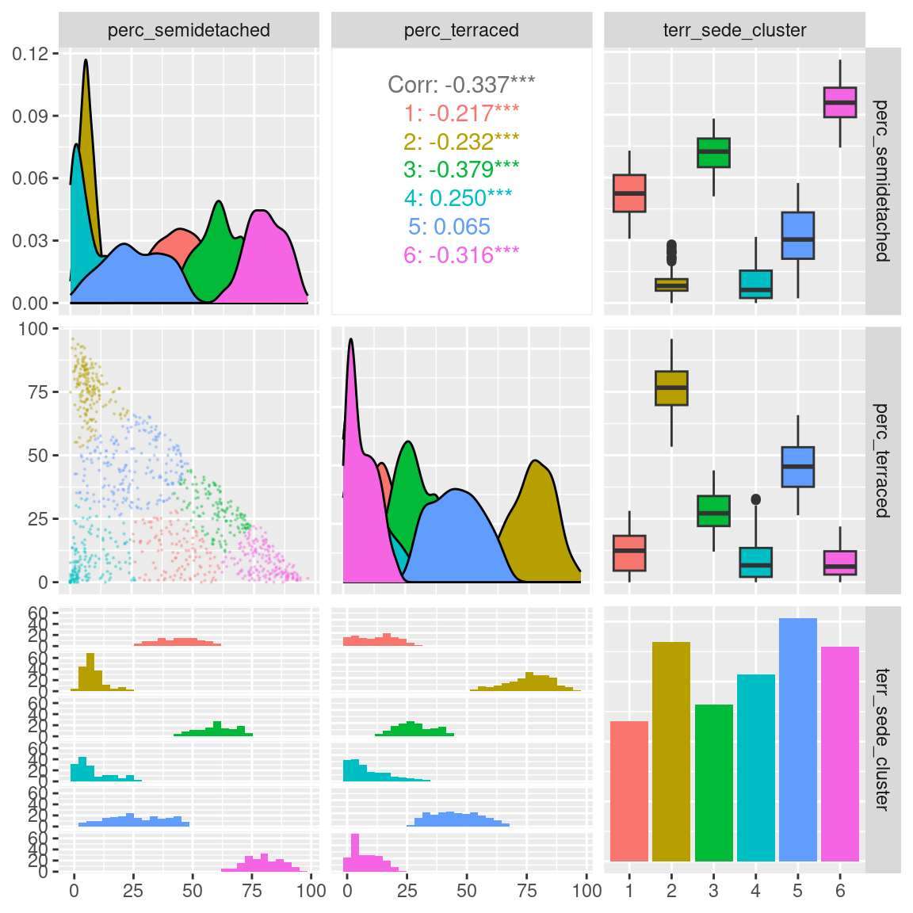
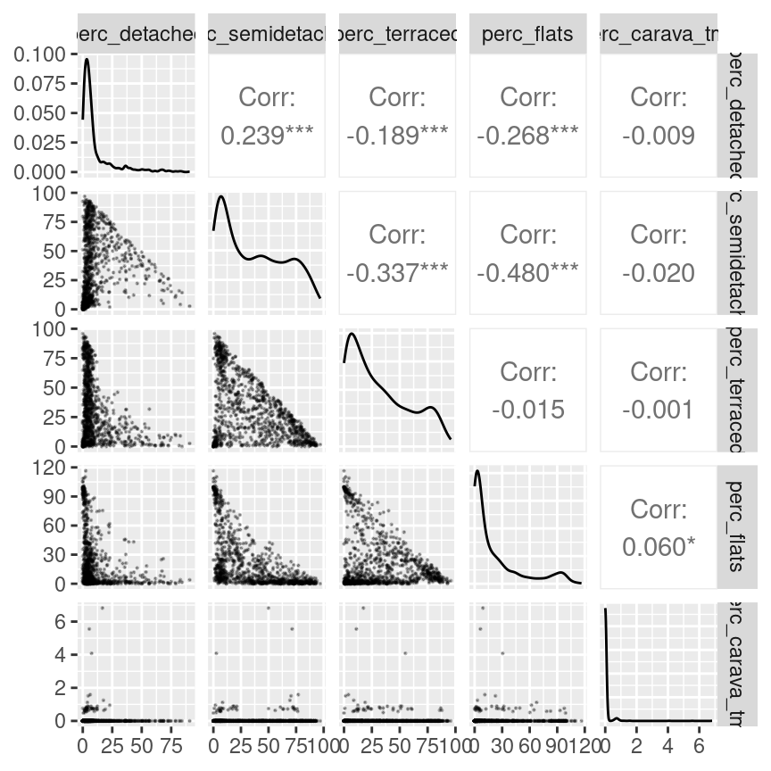
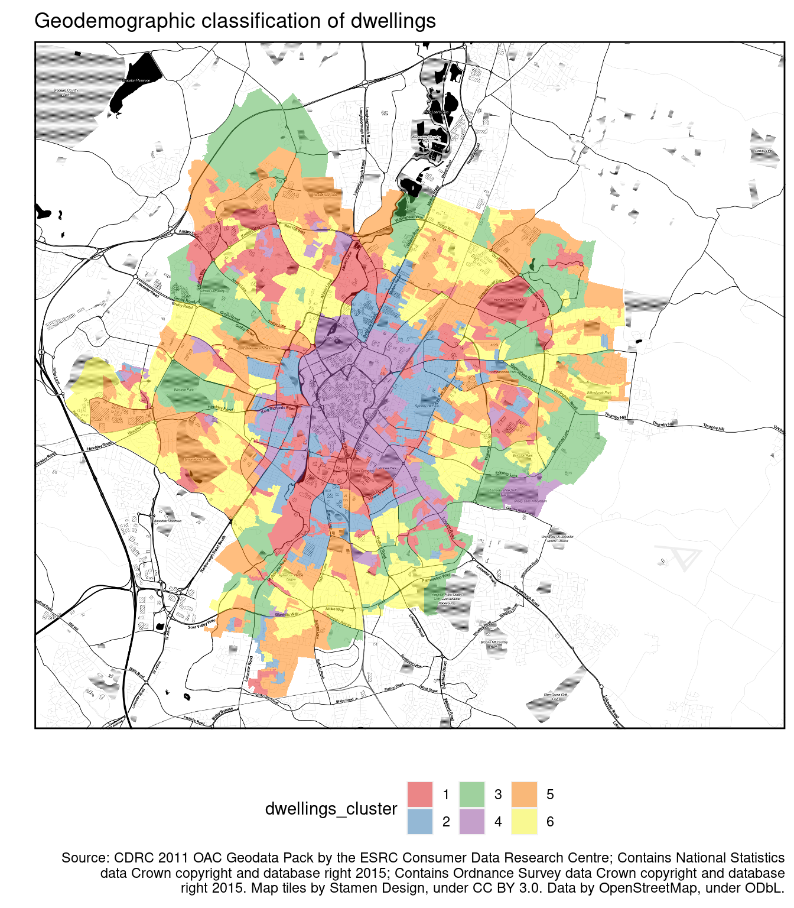

# Unsupervised machine learning

<br/><small><a href="javascript:if(window.print)window.print()">Print this chapter</a></small>

As discussed in the previous chapter, machine learning approaches are divided into two main types^[Although, many other types of machine learning exist, such as semi-supervised and reinforcement learning].

- **Supervised**:
    - training of a *"predictive"* model from data;
    - one (or more) attribute of the dataset is used to "predict" another attribute.

- **Unsupervised**:
    - discovery of *descriptive* patterns in data;
    - commonly used in data mining.
    
Clustering is a classic unsupervised machine learning task, which aims to *"automatically divides the data into* ***clusters*** *, or groups of similar items"*(Lantz, 2019). In computer science, a wide range of approaches has been developed to tackle clustering. Among those approaches, the two most common are centroid-based approaches (such as k-means) and hierarchical approaches. Other approaches include density-based clustering methods (such as DBSCAN) and mixed approaches (such as bagged clustering), which combine different aspects of centroid-based and hierarchical approaches.

## K-means

The k-mean approach clusters $n$ observations ($x$) in $k$ clusters ($c$) by minimising the within-cluster sum of squares (WCSS) through an iterative process. That is, the algorithm calculates the distance between each observation (i.e., each case, object, row in the table) and the centroid of its cluster. The square values of those distances are summed up for each cluster, and then for the whole dataset. The aim of the algorithm is minimise that value.

$$WCSS = \sum_{c=1}^{k} \sum_{x \in c} (x - \overline{x}_c)^2$$

To minimise WCSS, while trying to identify `k` clusters, k-mean first randomly select `k` observations as initial centroids. Then, k-means repeats the two steps below. Every time k-means repeats those two steps, the new centroids will be closer to the two actual centre. The process continues until centroids don't change anymore (within a certain margin of error) or until it has reached a maximum number of iterations set by the analyst.

- **assignment step**: observations assigned to closest centroids
- **update step**: calculate means for each cluster, as new the centroid

### Number of clusters

A key limitation of k-mean is that it requires to select the number of clusters to be identified in advance. Unfortunately, analysts are not always in the position of knowing in advance how many clusters are there supposed to be within the data they are analysing. In such cases, there are a number of heuristics that can be used to select the number of clusters that best fits the data.

The most well-known method is the *"elbow method"*. This approach suggests to calculate k-means for a range of values of k, calculate the WCSS obtained for each k, and then select the value of k that minimises WCSS without increasing the number of clusters beyond the point where the decrease in WCSS is minimal. This approach is called *"elbow method"* because (as can be seen in the examples below) when printing a line representing the value of WCSS for all values of k taken into account, it suggests to select the value of k at the *"elbow"* or inflation point of the line.

Other heuristics exist, which suggest using alternative measures of cluster quality. For instance, the `cluster` library provides simple ways to calculate the [silhouette](https://en.wikipedia.org/wiki/Silhouette_(clustering)) measure and the [gap statistic](http://web.stanford.edu/~hastie/Papers/gap.pdf). The silhouette value indicates how well observations fit within their clusters, whereas the gap statistic measures the dispersion within each cluster, compared to a uniform distribution of values. The higher the value of the gap statistic, the further away the distribution is from uniform (thus the higher the quality of the clustering).

For all three heuristics, the best approach would be to calculate those values using a bootstrapping approach. That is, to calculate the same statistics multiple times on samples of the dataset, in order to account for random variation. However, only the `clusGap` function of the `cluster` library allows for bootstrapping natively, as illustrated below.


## Geodemographic Classification

In GIScience, clustering approaches are commonly used to create *geodemographic classifications*. For instance, [Gale *et al.*, 2016](http://josis.net/index.php/josis/article/view/232/150) created the [2011 Output Area Classification (2011 OAC)](https://maps.cdrc.ac.uk/#/geodemographics/oac11/default/BTTTFFT/12/-1.1233/52.6454/) starting from an initial set of 167 prospective variables from the UK Census 2011.

In the process of creating the classification, 86 variables were removed from the initial set, including highly correlated variables that don't bring additional information to the classification process. Furthermore, 41 variable were retained as they were, whereas 40 were combined, to create final set of 60 variables. The k-mean approach was then applied to cluster the census Output Areas (OAs) into 8 supergroups, 26 groups and 76 subgroups.

The [paper](http://josis.net/index.php/josis/article/view/232/150) provides a detail report of the process. In particular, it is interesting to see how the authors applied a process of variable selection involving repeated clustering while excluding one variable, to see how the within cluster sum of square measure (WCSS) would be affected. Variable that produced significantly higher WCSS when excluded were considered for exclusion from the final analysis, in order to increase the homogeneity of the clusters. 

Once the clustering is completed, the final step in geodemographic classification is the interpretation of the resulting cluster, which is commonly done by observing the average values of the variables for each cluster.

The two examples below explore the creation of simple geodemographic classifications for the city of Leicester, using a few variables from the United Kingdom 2011 Census and included among the 167 initial variables that [Gale *et al.*, 2016](http://josis.net/index.php/josis/article/view/232/150) have taken into account in creating the [2011 Output Area Classification](https://maps.cdrc.ac.uk/#/geodemographics/oac11/default/BTTTFFT/12/-1.1233/52.6454/). 


```r
library(tidyverse)
```

```
## ── Attaching packages ─────────────────────────────────────── tidyverse 1.3.2 ──
## ✔ ggplot2 3.4.0      ✔ purrr   0.3.5 
## ✔ tibble  3.1.8      ✔ dplyr   1.0.10
## ✔ tidyr   1.2.1      ✔ stringr 1.4.1 
## ✔ readr   2.1.3      ✔ forcats 0.5.2 
## ── Conflicts ────────────────────────────────────────── tidyverse_conflicts() ──
## ✖ dplyr::filter() masks stats::filter()
## ✖ dplyr::lag()    masks stats::lag()
```

```r
library(magrittr)
```

```
## 
## Attaching package: 'magrittr'
## 
## The following object is masked from 'package:purrr':
## 
##     set_names
## 
## The following object is masked from 'package:tidyr':
## 
##     extract
```

```r
library(cluster)
```


```r
leicester_2011OAC <- readr::read_csv("2011_OAC_Raw_uVariables_Leicester.csv")
```


The variables that we are going to take into account are the five ones listed below, plus the total count for their statistical unit, that is `Total_Dwellings`.

- `u086`: Detached
- `u087`: Semi-detached
- `u088`: Terraced (including end-terrace)
- `u089`: Flats
- `u090`: Caravan or other mobile or temporary structure

The code below extracts the necessary variables from the original dataset and applies the normalisation steps across all the five variables listed above. Finally, the columns are renamed with more user-friendly names and adding `perc_` in front of the column name.


```r
leicester_dwellings <-
  leicester_2011OAC %>%
  dplyr::select(
    OA11CD, Total_Dwellings,
    u086:u090
  ) %>%
  # scale across
  dplyr::mutate(
    dplyr::across( 
      u086:u090,
      #scale
      function(x){ (x / Total_Dwellings) * 100 }
    )
  ) %>%
  dplyr::rename(
    detached = u086,
    semidetached = u087,
    terraced = u088,
    flats = u089,	
    carava_tmp = u090
  ) %>%
  # rename columns
  dplyr::rename_with(
    function(x){ paste0("perc_", x) },
    detached:carava_tmp
  )
```

The first step of k-means is to select some observations at random as initial centroids. As a result, every time we run the computation, the starting point will be slightly different, and so might be the result. In particular, it is likely that the cluster order might chance (i.e., what was cluster `1` one time might be cluster `3` the next), although the overall result should be stable. Nevertheless, to make this document more reproducible, we can set a *"seed"* for the generation of random numbers. That will ensure that the observations selected at random will be the same, and thus the results will be the same. That can be done in R, using the function `set.seed` and providing a number (any relatively large number will do) as *"seed"*.


```r
set.seed(20201208)
```


## Terrace and semi-detached houses

The first example explores how to create a geodemographic classification using only two variables.

- `u087` (now `semidetached`): Semi-detached
- `u088`(now `terraced`): Terraced (including end-terrace)

As a first step, we can explore the relationship between the two variables. The code below illustrates the use of the [`ggpairs`](https://ggobi.github.io/ggally/articles/ggpairs.html) of the [`GGally`](https://ggobi.github.io/ggally/) library, which provides additional and more complex plots on top of the `ggplot2` framework.


```r
# install.packages("GGally")
library(GGally)

leicester_dwellings %>%
  dplyr::select(perc_semidetached, perc_terraced) %>%
  GGally::ggpairs(
    upper = list(continuous = wrap(ggally_cor, method = "kendall")),
    lower = list(continuous = wrap("points", alpha = 0.3, size=0.1))
  )
```


The scatterplot above seems to indicate that at least three clusters might exist in the data. One with a lot of semi-detached and few terraced house (top-left corner of the scatterplot); one with a lot of terraced and few semi-detached houses (bottom-right corner of the scatterplot); and one with very few of both classes (bottom-left corner of the scatterplot).

However, there are clearly many OAs which populate the area in between those three groups. So, what is the best approach to cluster those OAs?

The code below illustrates how to create three plots. The first follows the elbow method heuristic. The second and the third take a similar approach but using the silhouette and gap statistic. Please see the [chapter on control structures](control-structures.html) regarding the use of the construct `for`.


```r
# Get only the data necessary for testing
data_for_testing <-
  leicester_dwellings %>%
  dplyr::select(perc_semidetached, perc_terraced)

# Calculate WCSS and silhouette
# for k = 2 to 15
# Set up two vectors where to store
# the calculated WCSS and silhouette value
testing_wcss <- rep(NA, 15)
testing_silhouette <- rep(NA, 15)

# for k = 2 to 15
for (testing_k in 2:15){
  # Calculate kmeans
  kmeans_result <- 
    stats::kmeans(data_for_testing, centers = testing_k, iter.max = 50)
  
  # Extract WCSS
  # and save it in the vector
  testing_wcss[testing_k] <- kmeans_result %$% tot.withinss
  
  # Calculate average silhouette
  # and save it in the vector
  testing_silhouette[testing_k] <- 
    kmeans_result %$% cluster %>%
    cluster::silhouette(
      data_for_testing %>% dist()
    ) %>%
    magrittr::extract(, 3) %>% mean()
}

# Calculate the gap statistic using bootstrapping
testing_gap <- 
  cluster::clusGap(
    data_for_testing, 
    FUN = kmeans, 
    K.max = 15, # max number of clusters
    B = 50      # number of samples
  )
```


```r
# Plots
plot(2:15, testing_wcss[2:15], type="b", xlab="Number of Clusters", 
     ylab="WCSS", xlim=c(1,15)) +
abline(v = 3, col = "red") +
abline(v = 6, col = "red")
```


```
## integer(0)
```

```r
plot(2:15, testing_silhouette[2:15], type="b", xlab="Number of Clusters", 
     ylab="Silhouette", xlim=c(1,15)) +
abline(v = 3, col = "red") +
abline(v = 6, col = "red")
```


```
## integer(0)
```

```r
plot(2:15, testing_gap[["Tab"]][2:15, "gap"], type="b", xlab="Number of Clusters", 
     ylab="Gap", xlim=c(1,15)) +
abline(v = 3, col = "red") +
abline(v = 6, col = "red")
```


```
## integer(0)
```

Based on the WCSS plot, the number of clusters k best fitting the data could range between `k = 3` and `k = 6`, which are all around the inflation point (elbow) of the line. The silhouette plot shows a local maximum at `k = 3` and `k = 6`, which indicates that the observations best fit within their clusters when 3 or 6 clusters are created. The gap statistic steadily increases until it reaches a plateau around `k = 5`. That indicates that clustering improves as we move from 2 to 5 clusters, but the quality doesn't increase as much afterwards. The value for `k = 6` (which is the value suggested by the other two heuristics) is a local minimum, but still the difference with neighbouring values is relatively small. 

Overall, the heuristics seem to indicate that `k = 3` could lead to a good clustering result. However, the gap statistic indicates that those three clusters would not be very compact. That is probably due to the fact that the observations at center of the scatterplot seen above are rather uniformally distributed over the space between the three main clusters. As such, chosing `k = 6` clusters might be the best fitting approach in this case. We can then calculate the clusters for `k = 6` as shown below.


```r
terr_sede_kmeans <- leicester_dwellings %>%
  dplyr::select(perc_semidetached, perc_terraced) %>%
  stats::kmeans(centers = 6, iter.max = 50)

leicester_dwellings <- 
  leicester_dwellings %>%
  tibble::add_column(
    terr_sede_cluster = terr_sede_kmeans %$% cluster %>% as.character()
  )
```

### Interpreting the clusters

After the clustering has been completed, we can analyse the results through a visual analysis. For instance, we can plot the two original variables, along with the computed clusters as illustrated below.


```r
leicester_dwellings %>%
  dplyr::select(perc_semidetached, perc_terraced, terr_sede_cluster) %>%
  GGally::ggpairs(
    mapping = aes(color = terr_sede_cluster),
    upper = list(continuous = wrap(ggally_cor, method = "kendall")),
    lower = list(continuous = wrap("points", alpha = 0.3, size=0.1))
  )
```



Another common approach in interpreting the results is to create *heatmaps* for the average values of the variables used in the clustering process for each cluster.


```r
leicester_dwellings %>%
  group_by(terr_sede_cluster) %>%
  dplyr::summarise(
    avg_perc_semidetached = mean(perc_semidetached), 
    avg_perc_terraced = mean(perc_terraced)
  ) %>%
  dplyr::select(terr_sede_cluster, avg_perc_semidetached, avg_perc_terraced) %>%
  tidyr::pivot_longer(
    cols = -terr_sede_cluster,
    names_to = "clustering_dimension",
    values_to = "value"
  ) %>%
  ggplot2::ggplot(
    aes(
      x = clustering_dimension,
      y = terr_sede_cluster
    )
  ) +
  ggplot2::geom_tile(aes(fill = value)) +
  ggplot2::xlab("Clustering dimension") + 
  ggplot2::ylab("Cluster") +
  ggplot2::scale_fill_viridis_c(option = "inferno") +
  ggplot2::theme_bw()
```


The plot above, clearly illustrates how cluster 6 has a high percentage of semi-detached houses and a low percentages of terraced houses. Cluster 2 has a high percentage of terraced houses and a low percentages of semi-detached houses. Cluster 4 has a low percentage of both semi-detached and terraced houses. Those are the three clusters that we first identified from the first scatterplot above.

Moreover, the clustering process identifies cluster 1, which includes similar percentages of semi-detached and terraced houses; as well as cluster 5, including mostly semi-detached but also some terraced houses, and cluster 3, including mostly terraced but also some semi-detached houses.

## A geodemographic of dwelling types

The case study above is useful as a simple example of how to create a geodemographic classification, but possibly not the most interesting analysis due to the limited number of variables used. In this section, we explore the creation of a geodemographic of dwelling types in the city of Leicester, using all five variables available in the original dataset.

As before we can start from a visual analysis of the data. The relationship between the different variables generally resembles the one seen between semi-detached and terraced houses seen in the example above, except for caravans and mobile or temporary structures, which seem fairly rare in Leicester. No variable seems to be particularly well correlated to any other. Thus all variables should be included in the classification, as they all have the potential to contribute relevant information.


```r
leicester_dwellings %>%
  dplyr::select(perc_detached:perc_carava_tmp) %>%
  GGally::ggpairs(
    upper = list(continuous = wrap(ggally_cor, method = "kendall")),
    lower = list(continuous = wrap("points", alpha = 0.3, size=0.1))
  )
```



In order to identify the number of clusters `k` which best fits the data, we can use the elbow method, along with the silhouette and gap statistic measures, as seen in the previous example. The only difference is that in this case `data_for_testing` will include all five variables.


```r
# Data for elbow method
data_for_testing <-
  leicester_dwellings %>%
  dplyr::select(perc_detached:perc_carava_tmp)

# Calculate WCSS and silhouette
# for k = 2 to 15
# Set up two vectors where to store
# the calculated WCSS and silhouette value
testing_wcss <- rep(NA, 15)
testing_silhouette <- rep(NA, 15)

# for k = 2 to 15
for (testing_k in 2:15){
  # Calculate kmeans
  kmeans_result <- 
    stats::kmeans(data_for_testing, centers = testing_k, iter.max = 50)
  
  # Extract WCSS
  # and save it in the vector
  testing_wcss[testing_k] <- kmeans_result %$% tot.withinss
  
  # Calculate average silhouette
  # and save it in the vector
  testing_silhouette[testing_k] <- 
    kmeans_result %$% cluster %>%
    cluster::silhouette(
      data_for_testing %>% dist()
    ) %>%
    magrittr::extract(, 3) %>% mean()
}

# Calculate the gap statistic using bootstrapping
testing_gap <- 
  cluster::clusGap(data_for_testing, FUN = kmeans, 
    K.max = 15, B = 50
  )
```


```r
# Plots
plot(2:15, testing_wcss[2:15], type="b", xlab="Number of Clusters", 
     ylab="WCSS", xlim=c(1,15)) +
abline(v = 3, col = "red") +
abline(v = 6, col = "red")
```


```
## integer(0)
```

```r
plot(2:15, testing_silhouette[2:15], type="b", xlab="Number of Clusters", 
     ylab="Silhouette", xlim=c(1,15)) +
abline(v = 3, col = "red") +
abline(v = 6, col = "red")
```


```
## integer(0)
```

```r
plot(2:15, testing_gap[["Tab"]][2:15, "gap"], type="b", xlab="Number of Clusters", 
     ylab="Gap", xlim=c(1,15)) +
abline(v = 3, col = "red") +
abline(v = 6, col = "red")
```


```
## integer(0)
```

As in the previous example, the elbow method (i.e., WCSS), silhouette and gap statistic seem to indicate that `k = 3` or  `k = 6` might be the best choice. Let's see what the result is when choosing `k = 6`.


```r
dwellings_kmeans <- leicester_dwellings %>%
  dplyr::select(perc_detached:perc_carava_tmp) %>%
  stats::kmeans(
    centers = 6, 
    iter.max = 50
  )

leicester_dwellings <- 
  leicester_dwellings %>%
  tibble::add_column(
    dwellings_cluster = 
      dwellings_kmeans %$% 
        cluster %>%
          as.character()
  )
```


### Interpreting the clusters

A first exploratory plot of the clusters seems to reveal clusters that closely resemble those seen in the first example above.


```r
leicester_dwellings %>%
  dplyr::select(perc_detached:perc_carava_tmp, dwellings_cluster) %>%
  GGally::ggpairs(
    mapping = aes(color = dwellings_cluster),
    lower = list(continuous = wrap("points", alpha = 0.3, size=0.1))
  )
```


\newpage

As in the previous example, we can use an *"heatmap"* plot to explore how the clusters are characterised by the variables used in the clustering process (see also Exercise 414.1.1 below).


```r
dwellings_cluster_avgs <-
  leicester_dwellings %>%
  group_by(dwellings_cluster) %>%
  dplyr::summarise(
    dplyr::across(
      perc_detached:perc_carava_tmp,
      mean
    ) 
  ) %>%
  # rename columns
  dplyr::rename_with(
    function(x){ paste0("avg_", x) },
    perc_detached:perc_carava_tmp
  )
  
dwellings_cluster_avgs %>%
  tidyr::pivot_longer(
    cols = -dwellings_cluster,
    names_to = "clustering_dimension",
    values_to = "value"
  )  %>%
  ggplot2::ggplot(
    aes(
      x = clustering_dimension,
      y = dwellings_cluster
    )
  ) +
  ggplot2::geom_tile(
    aes(
      fill = value
    )
  ) +
  ggplot2::xlab("Clustering dimension") + 
  ggplot2::ylab("Cluster") +
  ggplot2::scale_fill_viridis_c(option = "inferno") +
  ggplot2::theme_bw() +
  ggplot2::theme(
    axis.text.x = 
      element_text(
        angle = 90, 
        vjust = 0.5, 
        hjust=1
      )
    )
```


Another very common approach to explore the characteristics of the clusters created through k-means for the geodemongraphic classification is to use radar charts (also known as spider charts, web charts or polar charts), which can be created in R using a number of libraries, including the `radarchart` of the `fmsb` library.


```r
# install.packages("fmsb")
library(fmsb)

par(mar=rep(3,4))
par(mfrow=c(3,2))

for(cluster_number in 1:6){
  rbind (
    # The radar chart requires a maximum and a minimum row 
    # before the actual data
    rep(100, 5), # max 100% for 5 variables
    rep(0, 5),   # min 0% for 5 variables
    dwellings_cluster_avgs %>%
      dplyr::filter(dwellings_cluster == cluster_number) %>%
      dplyr::select(-dwellings_cluster) %>%
      as.data.frame()
    ) %>%
    fmsb::radarchart(title = paste("Cluster", cluster_number))
}
```


The radar charts are very effective in visualising the values for multiple varaibles, as long as the variables are all of similar type, value and range. In this case, as all values are percentages, radar chart are very effective in illustrating which variables have particularly high averages in each cluster.

Finally, we can map the cluster cartographically to analyse their spatial distribution.





## Exercise 414.1

**Question 414.1.1:** Based on the *"heatmap"*, radar charts and map created in the example above, how would you characterise the five clusters? How would you name them?.

**Question 414.1.2:** Create a geodemographic classification using the data seen in the second example above, but creating `k = 9` clusters.

**Question 414.1.3:** Create a geodemographic classification for the city of Leicester based on the presence of peoples in the different age groups included in the `2011_OAC_Raw_uVariables_Leicester.csv` dataset (`u007` to `u019`).


---

<small>by [Stefano De Sabbata](https://sdesabbata.github.io/) -- text licensed under the [CC BY-SA 4.0](https://creativecommons.org/licenses/by-sa/4.0/), contains public sector information licensed under the [Open Government Licence v3.0](http://www.nationalarchives.gov.uk/doc/open-government-licence), code licensed under the [GNU GPL v3.0](https://www.gnu.org/licenses/gpl-3.0.html).</small>
