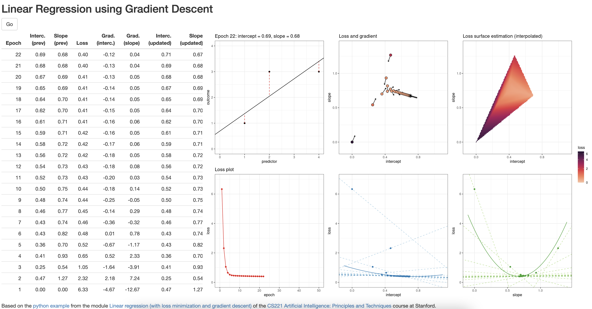

class: inverse, center, middle

```{r setup, include=FALSE}
knitr::opts_chunk$set(echo = FALSE)
knitr::opts_knit$set(root.dir = Sys.getenv("RGDS_HOME"))
rm(list = ls())
```


# Simple Regression

```{r, echo=FALSE, message=FALSE, warning=FALSE,}
library(tidyverse)
library(magrittr)  
library(palmerpenguins)
library(pastecs)
library(psych)
library(lmtest)
library(GGally)

library(conflicted)
conflict_prefer("select", "dplyr")
conflict_prefer("filter", "dplyr")
```

---
## Recap

.pull-left[

<br/>

**Prev**: Comparing data

- Comparing distributions through mean
- Correlation analysis
- Variable transformation

**Today**: Regression analysis

- Simple regression
- Least square via gradient descent
- Logistic regression

<br/>

]
.pull-right[

```{r, echo=FALSE, message=FALSE, warning=FALSE, fig.width = 7, fig.height = 7}
penguins %>%
  ggplot(aes(x = flipper_length_mm, y = body_mass_g)) +
  geom_point(aes(color = species,
                 shape = species),
             size = 2) +
  scale_color_manual(values = c("darkorange","darkorchid","cyan4")) +
  geom_smooth(method=lm) +
  theme_bw()
```


]


---
## Regression analysis

<br/>

**Regression analysis** is a supervised machine learning approach

Special case of the general linear model

$$ outcome_i = (model) + error_i $$

<br/>

Predict (estimate) value of one outcome (dependent) variable as

- one predictor (independent) variable: **simple / univariate**

$$Y_i=(b_0+b_1*X_{i1})+\epsilon_i$$
    
- more predictor (independent) variables: **multiple / multivar.**

$$Y_i=(b_0+b_1*X_{i1}+b_2*X_{i2}+\dots+b_M*X_{iM})+\epsilon_i$$

---
## Example

Can we predict a penguin's body mass from flipper length?

$$body\ mass_i=(b_0+b_1*flipper\ length_{i})+\epsilon_i$$

.center[

```{r, echo=FALSE, message=FALSE, warning=FALSE, fig.width = 10, fig.height = 6}
penguins %>%
  ggplot(aes(x = flipper_length_mm, y = body_mass_g)) +
  geom_point(aes(color = species,
                 shape = species),
             size = 2) +
  scale_color_manual(values = c("darkorange","darkorchid","cyan4")) +
  theme_bw()
```

]


---
## Example

Can we predict a penguin's body mass from flipper length?

$$body\ mass_i=(b_0+b_1*flipper\ length_{i})+\epsilon_i$$

.center[

```{r, echo=FALSE, message=FALSE, warning=FALSE, fig.width = 10, fig.height = 6}
penguins %>%
  ggplot(aes(x = flipper_length_mm, y = body_mass_g)) +
  geom_point(aes(color = species,
                 shape = species),
             size = 2) +
  scale_color_manual(values = c("darkorange","darkorchid","cyan4")) +
  geom_smooth(method=lm) +
  theme_bw()
```

]


---
## Least squares

.pull-left[

**Least squares** is the most commonly used approach to generate a regression model

The model fits a line
    
- to **minimise** the squared values of the **residuals** (errors)
- that is squared difference between
    - **observed values**
    - **model**
    
<br/>

$$residual_i=observed_i-model_i$$

$$deviation=\sum_i(observed_i-model_i)^2$$

]
.pull-right[

.center[


.referencenote[
by  Krishnavedala<br/>
via Wikimedia Commons,<br/>CC-BY-SA-3.0
]
]

]


---
## Least squares via gradient descent

<center>



[sdesabbata.shinyapps.io/linear-regression-gd](https://sdesabbata.shinyapps.io/linear-regression-gd/)

</center>


---
## Least squares: Assumptions

.pull-left[

<br/>

- **Linearity**
    - the relationship is actually linear
- **Normality** of residuals
    - standard residuals are normally distributed with mean `0`
- **Homoscedasticity** of residuals
    - at each level of the predictor variable(s) the variance of the standard residuals should be the same (*homo-scedasticity*) rather than different (*hetero-scedasticity*) 
- **Independence** of residuals
    - adjacent standard residuals are not correlated

]
.pull-right[

.center[


.referencenote[
by  Krishnavedala<br/>
via Wikimedia Commons,<br/>CC-BY-SA-3.0
]
]

]

---
## stats::lm

.pull-left[

.small[

```{r, echo=TRUE}
bm_fl_model <-
  penguins %>%
  filter(
    !is.na(body_mass_g) &
    !is.na(flipper_length_mm)
  ) %$%
  lm(body_mass_g ~ flipper_length_mm)

bm_fl_model %>%  
  summary()
```

]

]
.pull-right[

```{r, echo=FALSE}
bm_fl_model_summary <- bm_fl_model %>%
  summary()
```

The output indicates

- **p-value: < 2.2e-16**: $p<.01$ the model is significant
  - derived by comparing **F-statistic** (`r bm_fl_model_summary$fstatistic[1] %>% round(digits = 2)`) to F distribution having specified degrees of freedom (`r bm_fl_model_summary$fstatistic[2]`, `r bm_fl_model_summary$fstatistic[3]`)
  - Report as: F(`r bm_fl_model_summary$fstatistic[2]`, `r bm_fl_model_summary$fstatistic[3]`) = `r bm_fl_model_summary$fstatistic[1] %>% round(digits = 2)`
- **Adjusted R-squared: `r bm_fl_model_summary$adj.r.squared %>% round(digits = 4)`**: 
  - flipper length can account for `r (bm_fl_model_summary$adj.r.squared * 100) %>% round(digits = 2)`% variation in body mass
- **Coefficients**
  - Intercept estimate `r bm_fl_model_summary$coefficients[1,1] %>% round(digits = 4)` is significant
  - `flipper_length_mm` (slope) estimate `r bm_fl_model_summary$coefficients[2,1] %>% round(digits = 4)` is significant

]


---
## Outliers and influential cases

```{r, echo=TRUE, message=FALSE, warning=FALSE}
penguins_output <-
  penguins %>%
  filter(!is.na(body_mass_g) | !is.na(flipper_length_mm)) %>%
  mutate(
    model_stdres = bm_fl_model %>% rstandard(),
    model_cook_dist = bm_fl_model %>% cooks.distance()
  )

penguins_output %>%
  select(body_mass_g, model_stdres, model_cook_dist) %>%
  filter(abs(model_stdres) > 2.58 | model_cook_dist > 1)
```

<br/>

- No influential cases (Cook's distance `> 1`) 
- There are a handful of outliers (4 abs std res `> 2.58`)


---
## Checking assumptions: normality

.pull-left[

Shapiro-Wilk test for normality of standard residuals, 

- robust models: should be **not** significant 

```{r, echo=TRUE, message=FALSE, warning=FALSE}
penguins_output %$% 
  shapiro.test(
    model_stdres
  )
```

{{content}}

]
.pull-right[

.center[

```{r, echo=FALSE, message=FALSE, warning=FALSE, fig.width = 7, fig.height = 7}
penguins_output %>%
  ggplot(aes(x = model_stdres)) +
  geom_histogram(
    aes(
      y =..density..
    ),
    bins = 100
  ) + 
  stat_function(
    fun = dnorm, 
    args = list(
      mean = penguins_output %>% pull(model_stdres) %>% mean(),
      sd = penguins_output %>% pull(model_stdres) %>% sd()),
    colour = "red", size = 1)

```
]

]

--

**Standard residuals are normally distributed!**


---
## Checking assumptions: homoscedasticity

.pull-left[

Breusch-Pagan test for homoscedasticity of standard residuals

- robust models: should be **not** significant

```{r, echo=TRUE, message=FALSE, warning=FALSE, fig.width = 3, fig.height = 3}
bm_fl_model %>% 
  bptest()
```

{{content}}

]
.pull-right[

```{r, echo=FALSE, message=FALSE, warning=FALSE, fig.width = 7, fig.height = 7}
bm_fl_model %>% 
  plot(which = c(1))
```

]

--

**Standard residuals are homoscedastic!**

---
## Checking assumptions: independence

<br/>

Durbin-Watson test for the independence of residuals

- robust models: statistic should be close to 2 (advised between 1 and 3) and **not** significant

```{r, echo=TRUE}
bm_fl_model %>%
  dwtest()
```

--

**Standard residuals are independent!**

Note: the result depends on the order of the data.


---
## Example

Yes, we can predict a penguin's body mass from flipper length!

$$body\ mass_i=(-5780.83+49.69*flipper\ length_{i})+\epsilon_i$$

.center[

```{r, echo=FALSE, message=FALSE, warning=FALSE, fig.width = 10, fig.height = 6}
penguins %>%
  ggplot(aes(x = flipper_length_mm, y = body_mass_g)) +
  geom_point(aes(color = species,
                 shape = species),
             size = 2) +
  scale_color_manual(values = c("darkorange","darkorchid","cyan4")) +
  geom_smooth(method=lm) +
  theme_bw()
```

]


---
## A different problem: classification

- *regression*: predicting a continuous output variable
- *classification*: predicting a categorical (nominal, including binary) output variable

For instance: can we automatically identify the two species based on the penguins' body mass?

```{r}
#| message: FALSE
#| warning: FALSE

penguins_to_learn <-
  palmerpenguins::penguins %>%
  filter(species %in% c("Adelie", "Gentoo")) %>%
  mutate(species = forcats::fct_drop(species)) %>%
  filter(!is.na(body_mass_g) | !is.na(bill_depth_mm)) %>%
  mutate(across(bill_length_mm:body_mass_g, scale))
```


<center>
```{r}
#| echo: FALSE
#| message: FALSE
#| warning: FALSE
#| fig.width:  8
#| fig.height: 2.5

penguins_to_learn %>%
  mutate(
    species_01 = dplyr::recode(species, Adelie = 0, Gentoo = 1)
  ) %>%
  ggplot(aes(x = body_mass_g, y = species)) +
  geom_point(
    aes(
      color = species,
        shape = species),
        size = 2
  ) +
  scale_color_manual(values = c("darkorange", "cyan4")) +
  theme_bw()
```
</center>


---
## Logistic regression {.smaller}


.pull-left[

There are different approaches on how to define it... this is probably the most common

<br/>

$$h(x) = \frac{1}{1 + e^{-(\color{purple}{w \cdot \phi(x)})}}$$

where $0.5$ is the (soft) decision bundary

- if $h(x) < 0.5$ probably Adelie
- if $h(x) > 0.5$ probably Gentoo

]
.pull-right[

```{r}
#| echo: FALSE
#| message: FALSE
#| warning: FALSE
#| fig.width:  5
#| fig.height: 4
ggplot() + 
  xlim(-10, 10) +
  xlab("x") +
  ylab("y") +
  stat_function(
    fun = function(x) { (1 / (1 + exp(-x))) }
  ) +
  theme_bw()
```

]


<br/>

**Interestingly**, that's equivalent to

<center>

$h_w(x) = \color{orchid}{\sigma} (w \cdot \phi(x))$ &nbsp;&nbsp;&nbsp; with &nbsp;&nbsp;&nbsp; $\color{orchid}{\sigma}(z) = \frac{1}{1 + e^{-z}}$

</center>


---
## Example

<br/>

```{r}
#| echo: TRUE
#| message: FALSE
#| warning: FALSE

penguins_to_learn <-
  palmerpenguins::penguins %>%
  filter(species %in% c("Adelie", "Gentoo")) %>%
  mutate(species = forcats::fct_drop(species)) %>%
  filter(!is.na(body_mass_g) | !is.na(bill_depth_mm)) %>%
  mutate(across(bill_length_mm:body_mass_g, scale)) %>%
  mutate(
    species_01 = dplyr::recode(species, Adelie = 0, Gentoo = 1)
  )
```


<center>
```{r}
#| echo: FALSE
#| message: FALSE
#| warning: FALSE
#| fig.width:  8
#| fig.height: 2.5

penguins_to_learn %>%
  mutate(
    species_01 = dplyr::recode(species, Adelie = 0, Gentoo = 1)
  ) %>%
  ggplot(aes(x = body_mass_g, y = species_01)) +
  geom_point(
    aes(
      color = species,
        shape = species),
        size = 2
  ) +
  scale_color_manual(values = c("darkorange", "cyan4")) +
  stat_smooth(method="glm", method.args=list(family="binomial"), se=FALSE) +
  ylab("") +
  theme_bw()
```
</center>


---
## stats::glm

```{r}
#| echo: TRUE
#| eval: TRUE

sp_bm_model <- penguins_to_learn %$%
  glm(species_01 ~ body_mass_g, family = binomial())

sp_bm_model %>%
  summary() %>%
  print()
```


---
## Logistic regression {.smaller}

Assumptions

- **Linearity** of the logit
    - predictors have linear relationship with log of outcome
- When more than one predictor: **no multicollinearity**
    - if two or more predictor variables are used in the model, each pair of variables not correlated

Pseudo-R2

- Approaches to calculating model quality (power)

Adding complexity

- Multiple logistic regression: multiple predictors
- Multinomial logistic regression: several categories as outcome


---
## Summary

.pull-left[

<br/>

**Today**: Regression analysis

- Simple regression
- Multiple regression
- Comparing models

**Next time**: Control structures

- Conditional statements
- Conditional and deterministic loops
- *Group work?*

<br/>

.referencenote[
Slides created via the R package [**xaringan**](https://github.com/yihui/xaringan). The chakra comes from [remark.js](https://remarkjs.com), [**knitr**](https://yihui.org/knitr), and [R Markdown](https://rmarkdown.rstudio.com).
]

]
.pull-right[

```{r, echo=FALSE, message=FALSE, warning=FALSE, fig.width = 7, fig.height = 7}
penguins %>%
  ggplot(aes(x = flipper_length_mm, y = body_mass_g)) +
  geom_point(aes(color = species,
                 shape = species),
             size = 2) +
  scale_color_manual(values = c("darkorange","darkorchid","cyan4")) +
  geom_smooth(method=lm) +
  theme_bw()
```


]

```{r cleanup, include=FALSE}
rm(list = ls())
```
